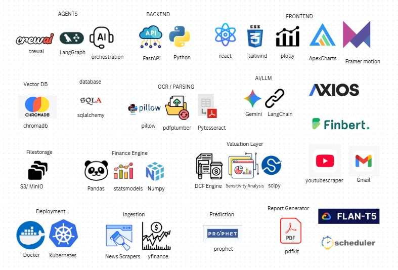

VioletAI
### *An End-to-End Multi-Agent Financial Analysis and Equity Research Automation System*

 

## 1. High-Level Architecture

The system follows a **Microservice-like Monolithic** architecture:
*   **Frontend**:  +  + 
*   **Backend**:  (Python) serving REST endpoints.
*   **Orchestration**:  for multi-agent logic.
*   **Data/Memory**:  + .
*   **Intelligence**:  +  + .

---

## 2. Frontend Implementation (`/frontend`)

### **Key Tech Stack**

*   **Build Tool**: Vite (`npm run dev` for instant HMR).
*   **State Management**: React `useState` / `useEffect` (local state) + custom `api.js` hooks.
*   **Visualizations**: `react-apexcharts` (Calculated candlesticks, line charts).
*   **Animations**: `framer-motion` (Smooth entry/exit of cards, e.g., in `SocialSentiment.jsx`).
*   **Icons**: `lucide-react` (Lightweight, consistent SVG icons).

### **Core Components Analysis**
1.  **`SocialSentiment.jsx`**:
    *   **Logic**: Fetches data concurrently from Reddit, StockTwits, and Twitter endpoints using `Promise.all`.
    *   **UI**: Implements a "Smart Tab" system that defaults to the platform### 1. ❓ Custom Report Questions
*(Implemented in: `backend/services/analysis_service.py` - `_generate_crew_report_body`)*. Uses a glassmorphism design (`glass-card` class).
    *   **Visuals**: Color-coded badges (Green/Red/Amber) dynamically set based on `sentiment_label`.

2.  **`PriceChart.jsx` / `ForecastChart.jsx`**:
    *   **Logic**: Receives raw time-series data. `ForecastChart` renders the `yhat` (prediction) line along with `yhat_lower` and `yhat_upper` (confidence intervals) as a shaded area.
    *   **Library**: **ApexCharts** is used here for its performance with large datasets (candlesticks).

3.  **`Analysis.jsx`**:
    *   **Flow**: Handles the "Run Analysis" button state. It polls the backend or waits for the long-running async request to complete. It conditionally renders the "Report" section only when the JSON response contains `report_body`.

---

##  3. Backend Services (`/backend/services`)

### 1.  Stock Analysis Dashboard
*(Implemented in: `frontend/src/pages/Analysis.jsx` and `frontend/src/components/PriceChart.jsx`)*vice** (`analysis_service.py`)
**The Brain of the operation.**
*   **Orchestration**: It acts as a facade, calling `yfinance`, `Prophet`, `CrewAI`, and `PDFGenerator`.
*   **LLM Handling**:
    *   **Provider Rotation**: Implements a retry loop (3 attempts). If Google Gemini hits a quota limit (429), it triggers `api_manager.rotate_key()` to switch to a backup key or provider (Groq).
    *   **Fallback**: If LLM fails completely, it calls `_build_report_text()` to generate a deterministic "safe mode" report using template strings.
*   **RAG Integration**: It automatically "ingests" the generated PDF report back into ChromaDB so the AI "remembers" its own past analysis.

### 4.  Social Sentiment (Reddit)
*(Implemented in: `backend/services/social_sentiment_service.py` and `frontend/src/components/SocialSentiment.jsx`)*ce** (`social_sentiment_service.py`)
*   **Logic**:
    *   Does **NOT** use the official Reddit API (which requires OAuth). Instead, it hits the public JSON endpoints (`https://www.reddit.com/r/{subreddit}/search.json`).
    *   **Scoring**: Uses a deterministic keyword dictionary (`bullish_words` vs `bearish_words`) to calculate a weighted average score based on post upvotes.
    *   **Key Insight**: It prioritizes posts from `wallstreetbets`, `stocks`, and `investing`.

### **C. StockTwits Service** (`stocktwits_service.py`)
*   **Logic**:
    *   Hits `api.stocktwits.com/api/2/streams/symbol/{TICKER}.json`.
    *   **Hybrid Scoring**: It first checks if the user explicitly tagged their post as "Bullish" or "Bearish" (metadata). If not, it falls back to the customized keyword analysis.

### **D. Scheduler Service** (`scheduler_service.py`)
*   **Library**: 
*   **Function**: Runs background tasks (likely for periodic data fetching or cache cleanup) without blocking the main FastAPI thread.

### **E. Utility Services (Email, YouTube, Twitter, Recommendation)**

#### **1. Email Integration** (`email_service.py`)
*   **Implementation**: A classic SMTP client wrapper using python’s built-in `smtplib`.
*   **Template**: It constructs a simple HTML body (`format_report_html`) that embeds the analysis summary, creating a clean branding wrapper around the raw text.

#### 6.  YouTube Video Feed
*(Implemented in: `backend/services/analysis_service.py` - `_fetch_youtube_videos`)*r** (in `analysis_service.py`)
> [!IMPORTANT]
> **Why Custom?** The official YouTube API has strict quota limits.
*   **Technique**: It performs a "Direct HTML Scraping" attack.
    *   It requests the YouTube search results page.
    *   Uses Regex to extract the specialized JSON blob `var ytInitialData = {...}` embedded in the page source.
    *   Parses this JSON to find video IDs, titles, and thumbnails without hitting any API limits.

#### **3. Twitter/X Sentiment** (`twitter_sentiment_service.py`)
*   **Mock Simulation**: Accessing X data is currently expensive (Enterprise API).
*   **Implementation**: This service currently implements a **Simulation Layer**. It generates realistic looking "Mock Tweets" (e.g., from user "TraderJoe") to demonstrate the UI capabilities without incurring API costs.
*   **Fallback**: It includes a keyword-based sentiment scorer (`_simple_sentiment_score`) ready to be hooked into a real scraper like Nitter.

#### 7.  PDF Report Generation
*(Implemented in: `backend/core/src/visuals.py`)* Engine** (`backend/core/recommendation/recommendation_engine.py`)
This is a **Hybrid Systems** implementation, combining Rule-Based Logic with Small-Language Models (SLMs).
*   **Logic (The "Score")**:
    *   It calculates a composite `final_score` (0-100) combining three factors:
        1.  **KPI Score**: Weighted average of financial ratios.
        2.  **Sentiment Score**: From FinBERT.
        3.  **Risk Penalty**: Deducts points if Debt-to-Equity > 1.0 or Sentiment < 0.2.
*   **Logic (The "Reasoning")**:
    *   It uses **Google Flan-T5-Small** (a local transformer model) to generate the text explanation.
    *   It constructs a prompt with the numeric scores and asks Flan-T5 to "Rewrite this as a short investment rationale."
>  
> **Why Flan-T5?** It's small enough to run on CPU without a GPU, making the recommendation engine highly portable.

---

#  AI Agents Overview

This document provides a comprehensive breakdown### 6. 🤖 CrewAI Multi-Agent System
*(Implemented in: `backend/services/analysis_service.py` and `rag_crew.py`)*** powering VioletAI. Our architecture uses specialized agents for distinct tasks (Research, Writing, Math, Compliance) to ensure high accuracy and reduce hallucinations.

---

### 6. Orchestration Engine
*   **Core Implementation**: `backend/services/analysis_service.py`
*   **Framework**: 
*   **Workflow**:
    1.  The `AnalysisService` initializes the `Crew`.
    2.  It defines the `Process.sequential` execution flow.
    3.  It passes the `Strategist`'s output (Market Analysis) as context to the `Analyst`.

---

##  Group 1: Core Research & Reporting Crew
*Orchestrated in `analysis_service.py` using *

These agents run when a user clicks **"Run Full Analysis"**. They simulate a Wall Street equity research team.

### 1. Lead Quantitative & Market Strategist
*   **Role**: The "Thinker" who connects the dots.
*   **Goal**: Conduct a deep-dive technical and fundamental analysis.
*   **Workflow**:
    *   Takes raw data: FHI Score (Math), Sentiment Score (FinBERT), and Prophet Forecast.
    *   Identifies correlations (e.g., "Sentiment is dropping despite rising prices -> Divergence risk").
    *   Passes structured notes to the Analyst.

### 2. Principal Equity Research Analyst
*   **Role**: The "Writer" who crafts the narrative.
*   **Goal**: Synthesize complex data into a high-density, professional investment brief.
*   **Workflow**:
    *   Receives the Strategist's notes.
    *   Writes the "Executive Summary", "Risks", and "Strategic Actions" sections.
    *   **Constraint**: specific formatting rules (Markdown) to ensure the UI renders charts and modules correctly.

---

##  Group 2: RAG & Document Intelligence
*Defined in `agents.py`. These power the **Chat** and **Document Search** features.*

### 3. Financial Evidence Retrieval Specialist
*   **Role**: The "Scout".
*   **Goal**: Find precise evidence in SEC filings (10-Ks, 10-Qs).
*   **Capability**: Uses vector search () to locate paragraphs relevant to a user's query (e.g., "What are the supply chain risks?").

### 4. Senior Financial Analyst (RAG)
*   **Role**: The "Interpreter".
*   **Goal**: Analyze the evidence found by the 'Scout'.
*   **Capability**: Can read financial tables or a risk disclosure and explain *why* it matters, identifying red flags in management commentary.

### 5. Citation & Compliance Specialist
*   **Role**: The "Auditor".
*   **Goal**: Ensure no hallucination.
*   **Action**: Verifies that every claim in the final answer has a citation pointing to a specific document source `[Source: 2023 Annual Report, Page 45]`.

### 6. Management### 4. 🎭 Sentiment Analysis
*(Implemented in: `backend/core/sentiment_agent/finbert.py` and `backend/core/sentiment_agent/agents/kpi_sentiment_agent.py`)*t
*   **Role**: The "Psychologist".
*   **Goal**: Detect hidden signals in text.
*   **Technique**: Analyzes "hedging" language (words like *may, could, possibly, unforeseen*) to determine if management is confident or hiding bad news.

### 7. Research Synthesis Specialist
*   **Role**: The "Composer".
*   **Goal**: Combine evidence into a final answer.
*   **Action**: Merges insights from multiple documents into a single, cohesive response with citations.

### 8. Financial Query Analyst
*   **Role**: The "Translator".
*   **Goal**: Optimize search queries.
*   **Action**: Converts a user's vague question ("Is this company good?") into specific semantic search queries.

### 9. Document Summarization Expert
*   **Role**: The "Compressor".
*   **Goal**: Create executive summaries.
*   **Action**: Compresses lengthy 100-page PDFs into concise bullet points without losing critical numerical details.

### 10. Document Q&A Specialist
*   **Role**: The "Front-Facing Exec".
*   **Goal**: Interface with the user.
*   **Action**: Takes the synthesized answer and formats it into a helpful, conversational response.

---

##  Group 3: Specialized / Hybrid Agents
*These combine AI with deterministic code for maximum precision.*

### 10. KPI & Sentiment Agent (`kpi_sentiment_agent.py`)
*   **Type**: Deterministic + AI Hybrid.
*   **Task**: Financial Health Calculation.
*   **Workflow**:
    1.  **Code**: Python functions calculate exact ratios (ROE, Debt-to-Equity).
    2.  **AI**: FinBERT calculates a sentiment score (-1 to +1).
    3.  **Synthesis**: Combines these into the **FHI### 3. 📊 Financial Health Index (FHI)
*(Implemented in: `backend/core/sentiment_agent/agents/kpi_sentiment_agent.py`)*** score (0-100).

### 11. Recommendation Engine (`recommendation_engine.py`)
*   **Type**: Small Language Model (SLM).
*   **Model**: `google/flan-t5-small` (Running locally/CPU).
*   **Task**: Explain the Rating.
*   **Workflow**:
    *   Takes the numeric scores (KPI, Sentiment, Risk).
    *   Generates the text: *"We implement a BUY rating because strong cash flow offsets the negative news sentiment."*
    *   **Why optimized?** Uses a small, fast model instead of a giant LLM to generate this short explanation quickly.

---

##  5. Key Libraries & Why They Were Used

| Library | Category | Usage |
| :--- | :--- | :--- |
|  | AI Orchestration | Managing the workflow between multiple agents (Researcher -> Writer). |
|  | Data Science | Time-series forecasting. Chosen for its ability to handle seasonality (holidays, weekends) better than standard linear regression. |
|  | Data Source | Scraping Yahoo Finance data for free (Price, Market Cap, Sector). |
|  | Vector DB | Local vector storage for RAG. It stores the "embeddings" of your PDFs. |
|  | ML | Converts text into vectors (numbers) for ChromaDB. |
|  | Backend Framework | Chosen for its async capabilities (essential for handling multiple LLM streams). |
|  | Frontend | Physics-based animations for the React UI. |
|  | Utilities | Python job scheduling (Cron-like behavior inside the app). |
|  | Validation | Data validation for all API requests/responses (ensures type safety). |

---

##  6. Special Implementation Details to Highlight

> [!NOTE]
> **Safety Net Report**: The system is designed to **never fail silently**. If the advanced AI crashes, the code seamlessly degrades to a "Quant-Only" report mode (`_build_report_text`), ensuring the user always gets *something* valuable.

>  
> **Self-Feeding Memory**: The unique feature where the *generated report* itself becomes part of the knowledge base. This means if you analyze AAPL today, and ask about it next week, the AI remembers its previous analysis.

> [!WARNING]
> **Multi-Model Fallback**: The `api_manager` allows the system to switch between Google Gemini and Groq (Llama 3) dynamically if one provider goes down or limits are reached.

## Novelty

## Overall Architecture

## Tech Stack

### Thank You!
*Team FiveX*

